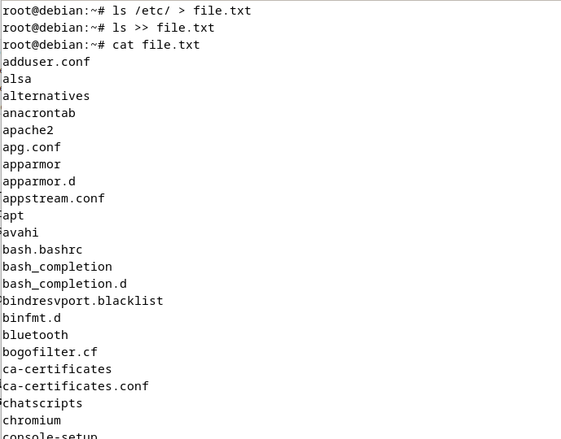
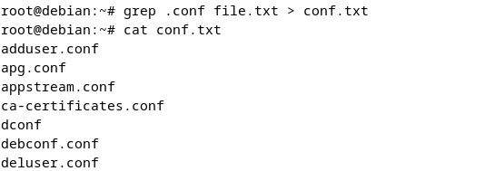
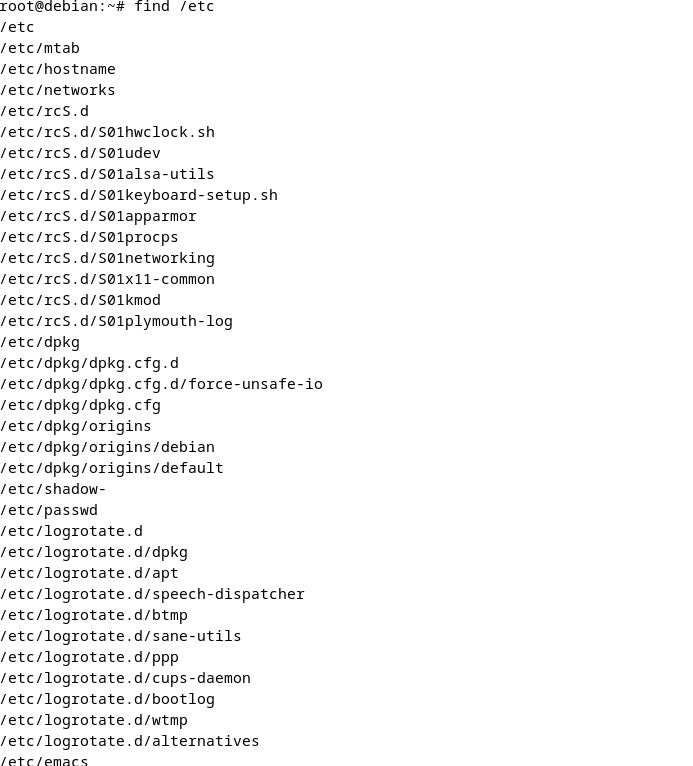
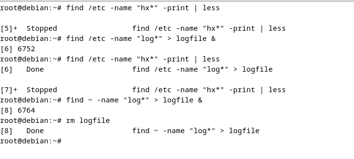
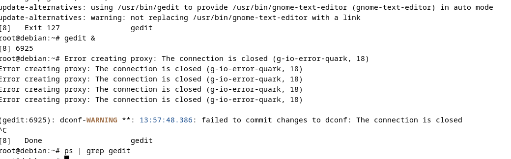
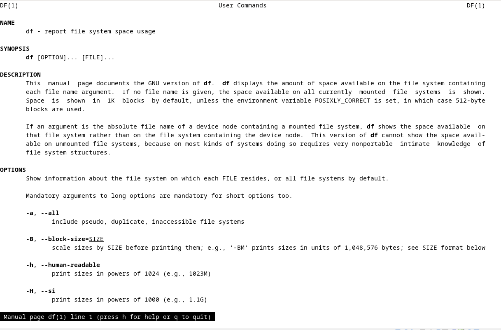
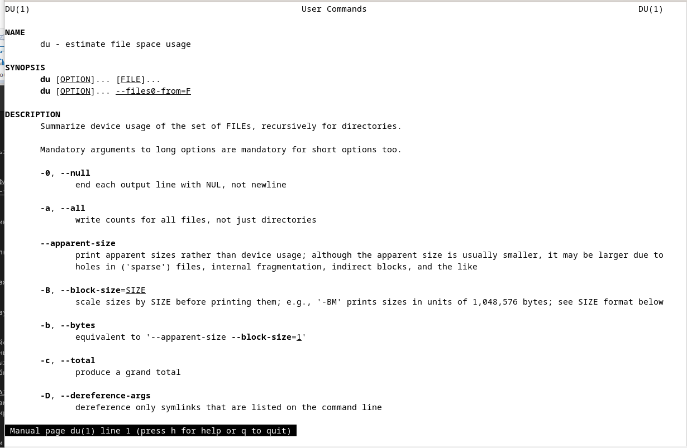
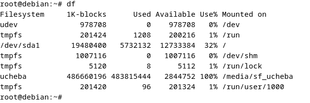
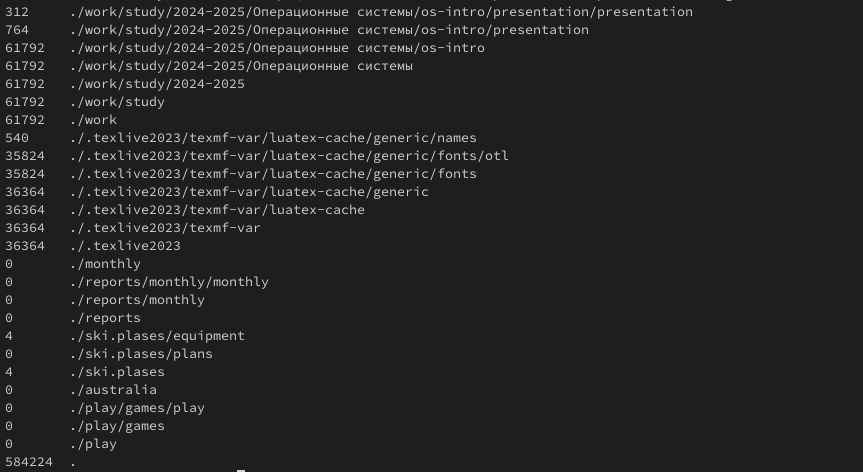
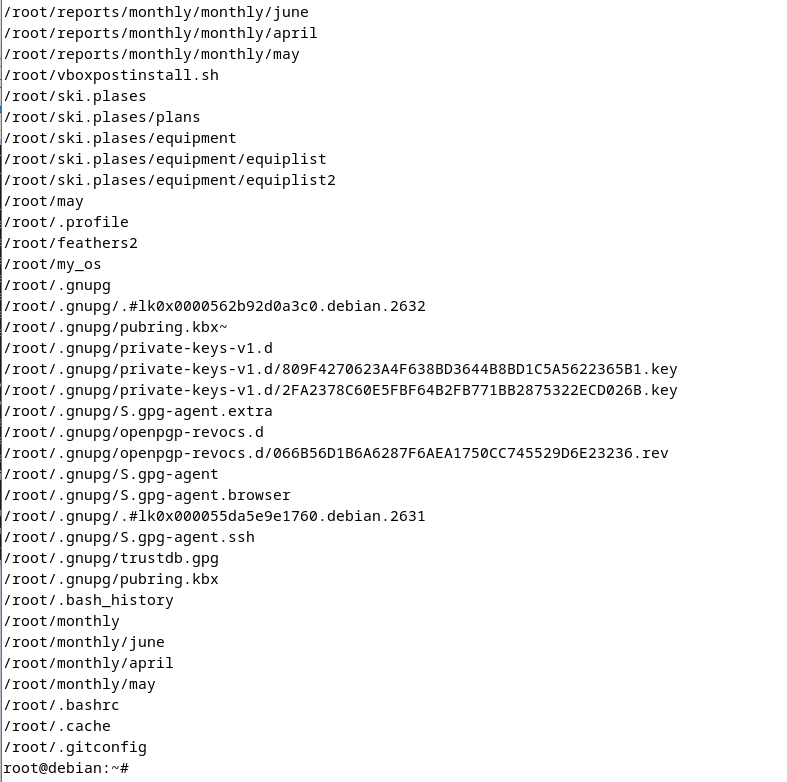

# Цели и задачи работы

## Цель лабораторной работы

Ознакомление с файловой системой Linux, её структурой, именами и содержанием каталогов. Приобретение практических навыков по применению команд для работы с файлами и каталогами, по управлению процессами, по проверке использования диска и обслуживанию файловой системы.

## Задачи лабораторной работы

1. Изучить перенаправление ввода-вывода  
2. Изучить работу фильтров  
3. Изучить команду поиска  
4. Ознакомиться с управлением процессами  
5. Ознакомиться с командами `df`, `du`  

# Процесс выполнения лабораторной работы

## Перенаправление ввода-вывода

{ #fig:001 height=70% width=70% }

## Работа фильтра

{ #fig:002 height=70% width=70% }

## Команда поиска

{ #fig:003 height=70% width=70% }

{ #fig:004 height=70% width=70% }

## Управление процессами

{ #fig:005 height=70% width=70% }

{ #fig:006 height=70% width=70% }

## Команды df и du

{ #fig:007 height=70% width=70% }

{ #fig:008 height=70% width=70% }

{ #fig:009 height=70% width=70% }

{ #fig:010 height=70% width=70% }

## Команда поиска

{ #fig:011 height=70% width=70% }

# Выводы по проделанной работе

## Вывод

В данной работе мы ознакомились с инструментами поиска файлов и фильтрации текстовых данных, а также приобрели практические навыки по управлению процессами.
